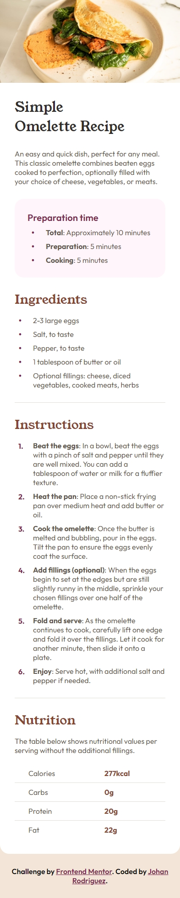
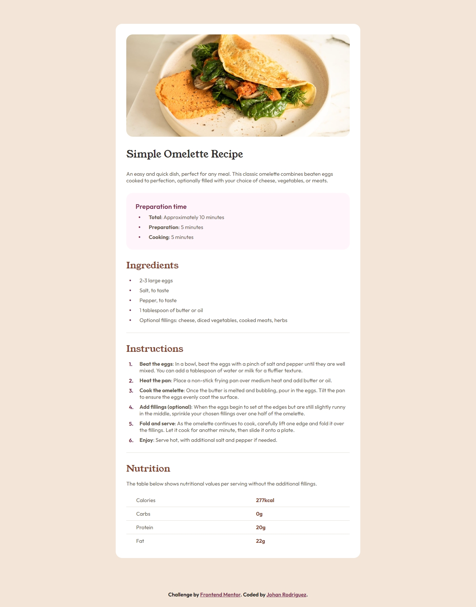

# Frontend Mentor - Recipe page solution

This is a solution to the [Recipe page challenge on Frontend Mentor](https://www.frontendmentor.io/challenges/recipe-page-KiTsR8QQKm). Frontend Mentor challenges help you improve your coding skills by building realistic projects.

## Table of contents

- [Frontend Mentor - Recipe page solution](#frontend-mentor---recipe-page-solution)
  - [Overview](#overview)
    - [Screenshots](#screenshots)
    - [Links](#links)
  - [My process](#my-process)
    - [Built with](#built-with)
    - [What I learned](#what-i-learned)
    - [Useful resources](#useful-resources)
  - [Author](#author)

## Overview

### Screenshots




### Links

- [Solution URL](https://www.frontendmentor.io/solutions/responsive-and-semantic-recipe-page-EMK06poBYS)
- [Live Site URL](https://jdrodriguez2707.github.io/recipe-page/)

## My process

### Built with

- Semantic HTML5 markup
- CSS custom properties
- Flexbox
- CSS Grid
- Mobile-first workflow

### What I learned

I learned how to style the bullets and numbers of the HTML list and how to style the `::before` and `::after` pseudo-elements to create custom bullets and numbers for the lists. I used the `content` property to add the custom bullets and numbers to the lists.

```css
.custom-bullet {
  position: relative;
  padding-left: 4rem;
  color: var(--stone-600);

  /* Custom bullet */
  &::before {
    content: "•";
    position: absolute;
    left: 0.8rem;
    color: var(--rose-800);
    font-size: 2.4rem;
    line-height: 0.9;
  }
}
```

```css
.instructions-list {
  display: flex;
  flex-direction: column;
  gap: 1rem;
  counter-reset: custom-counter; /* Initialize counter (numbers for list items) */
  list-style: none;
}

.instructions-item {
  position: relative;
  padding-left: 4rem;
  counter-increment: custom-counter; /* Increase counter */
  color: var(--stone-600);

  &::before {
    content: counter(custom-counter) "."; /* Number */
    position: absolute;
    left: 0.8rem;
    color: var(--rose-800);
    font-size: 1.6rem;
    font-weight: 700;
    line-height: 1.4;
  }
}
```

### Useful resources

- [Nu HTML Checker](https://validator.w3.org/nu/) - This helped me to validate my HTML code and make sure it was correct with the W3C standards.

## Author

- Frontend Mentor - [@jdrodriguez2707](https://www.frontendmentor.io/profile/jdrodriguez2707)
- LinkedIn - [Johan Rodriguez](https://www.linkedin.com/in/jdrodriguez2707/)
- X - [@Johan79854000](https://twitter.com/Johan79854000)
- Instagram - [@johan_rodriguez_dev](https://www.instagram.com/johan_rodriguez_dev)
